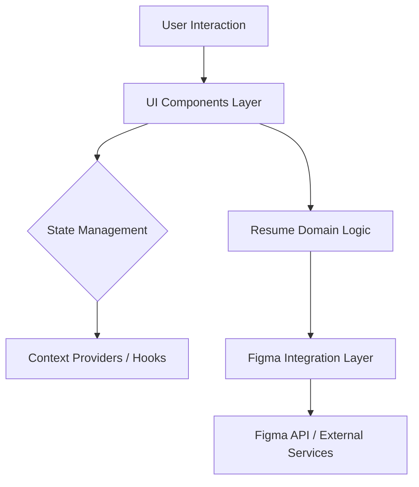

# Architecture Notes

The system is architected as a modular monolithic React application focusing on a resume-building experience tightly integrated with Figma for design components. The design emphasizes reusable UI components, layered abstractions for business logic, and integration with external APIs in a way that promotes maintainability and scalability. The current architecture centers around component-driven development, enabling composition and fine-grained control over UI behaviors and state management.

Key motivations for this design include:

- Reuse of UI components across different parts of the application for consistency and reduced maintenance.
- Separation of concerns through distinct architectural layers, yielding clear demarcation between presentation, business logic, and data handling.
- Facilitating integration with Figma and other design tools by encapsulating Figma-specific logic into dedicated directories for better unit testing and future extensibility.
- Supporting a responsive and dynamic user interface that adapts gracefully to different device sizes using hooks and utility functions such as `useIsMobile`.

# System Architecture Overview

The system is primarily a Single Page Application (SPA) implemented with React and TypeScript, deployed as a monolithic front-end bundle. It does not currently adopt a microservices or distributed architecture but organizes concerns into modular directories to encourage scalability and codebase hygiene.

### Topology and Deployment

- Monolithic React SPA hosted on a static web server or CDN.
- No backend server component within the repository; external services such as Figma APIs are consumed directly via client libraries.
- Build tools and bundlers (e.g., Vite) manage development and production builds, optimizing for performance and cacheability.

### Request Flow and Control

- User interactions funnel through high-level components and pages rendered on the client.
- Control pivots between:
  - **Presentation Layer** (UI components) for layout and rendering.
  - **Service Layer** (business logic services) for action orchestration.
  - **Integration Layer** (resume and figma-specific components) for external system interaction.
- Reactive hooks and context providers handle state synchronization and runtime behavior adjustments.

# Architectural Layers

- **UI Components**: Reusable and composable components for user interfaces (`components/ui/`, `resume/components/ui/`)
- **Figma Integration**: Components and utilities encapsulating interaction with Figma design files (`components/figma/`, `resume/components/figma/`)
- **Business Logic / Services**: Core domain logic and data manipulation (`src/services/`)
- **Content Generators**: Modules responsible for generating resume content programmatically (`src/generators/`)
- **Utilities**: Helper functions and abstractions to support other layers (`components/ui/utils.ts`, etc.)

> See [`codebase-map.json`](./codebase-map.json) for complete symbol counts and dependency graphs.

# Detected Design Patterns

| Pattern             | Confidence | Locations                     | Description                                                               |
|---------------------|------------|-------------------------------|---------------------------------------------------------------------------|
| Factory             | High       | `LLMClientFactory`             | Provides centralized creation of Large Language Model client instances.    |
| Hook-based State    | Very High  | `useIsMobile`                  | React hooks pattern for encapsulating responsive state logic.              |
| Context Provider    | High       | `TooltipProvider`, `SidebarContext` | Provides contextual state and behaviors to descendant components.           |
| Component Composition | Very High | UI components base directories | Modular UI design allowing flexible component assembly and reuse.          |
| Higher-Order Components | Medium    | DropdownMenu, NavigationMenu   | Encapsulate common UI interaction patterns and behaviors.                   |

# Entry Points

- [`src/main.tsx`](src/main.tsx) - Application bootstrap and root component mounting.
- [`components/ui/index.ts`](components/ui/index.ts) - Aggregated exports for UI components and utilities.
- [`resume/main.tsx`](resume/main.tsx) - Entry for the resume-specific sub-application portion.
- Various component directories expose entry points through `index.ts` files for composability.

# Public API

| Symbol             | Type         | Location                                  |
|--------------------|--------------|-------------------------------------------|
| `ChartConfig`      | Type         | `components/ui/chart.tsx:11`               |
| `cn`               | Function     | `components/ui/utils.ts:4`                  |
| `useIsMobile`      | Hook         | `components/ui/use-mobile.ts:5`             |
| `ImageWithFallback`| Component    | `components/figma/ImageWithFallback.tsx:6` |
| `TooltipProvider`  | Component    | `components/ui/tooltip.tsx:8`               |
| `Tabs`             | Component    | `components/ui/tabs.tsx:8`                  |
| `Switch`           | Component    | `components/ui/switch.tsx:8`                 |
| `useSidebar`       | Hook         | `components/ui/sidebar.tsx:47`               |

# Internal System Boundaries

The system is demarcated primarily by the domains of user interface, business logic, and external integration. Bounded contexts include:

- **UI Layer**: Owns state relevant to presentation and interaction components; manages visual-related business rules.
- **Resume Domain**: Encapsulates resume-related content generation and data handling.
- **Figma Integration**: Separately encapsulated logic and components for working with Figma to isolate third-party API contracts and prevent contamination of core domain logic.
- **Utilities Layer**: Shared helpers for cross-cutting concerns that do not introduce dependencies between other layers.

Synchronization between these domains occurs through well-defined component props, hooks, and React context providers enforcing clear contract boundaries.

# External Service Dependencies

- **Figma API**: Utilized for design integration purposes. Authentication is typically managed through OAuth or API tokens.
- **Potential cloud storage or CDN**: For serving static assets and deployed SPA bundles.
- Authentication details and rate limits are managed internally or delegated to the API clients without exposed custom rate limiting.

Failure considerations primarily involve fallback UI rendering (`ImageWithFallback` component) and error boundary components to prevent UI crashes on external API failure.

# Key Decisions & Trade-offs

- Chose React monolithic SPA architecture for rapid UI development and component reuse over microservices or backend-driven rendering.
- React Hooks and Context APIs were selected to manage state and dependency injection for their simplicity and idiomatic React patterns.
- Abstracted Figma integration into dedicated components to keep third-party dependencies isolated and replaceable.
- Opted for in-browser content generation and rendering to improve responsiveness but with considerations for client-side performance.

This approach balances developer ergonomics and user experience while maintaining scalability for future additions of serverless functions or APIs.

# Diagrams

# Risks & Constraints

- SPA architecture places dependency on client device for performance; less suited for low-powered or legacy browsers.
- External APIs such as Figma may have unpredictable rate limits or outages affecting integration reliability.
- Monolithic deployment can complicate scaling specific features independently without introducing microservices.
- SEO and initial load times can be impacted by client-side rendering, so static prerendering or SSR enhancements may be needed.

# Top Directories Snapshot

- `components/ui/` (~150 files) — Core user interface elements and utilities.
- `resume/components/ui/` (~120 files) — Resume-specific UI components.
- `components/figma/` (~30 files) — Figma integration components and utilities.
- `src/services/` (~40 files) — Business services and domain logic.
- `src/generators/` (~20 files) — Resume content and artifact generators.

# Related Resources

- [Project Overview](./project-overview.md)
- [Data Flow](./data-flow.md)
- [Codebase Map](./codebase-map.json)
