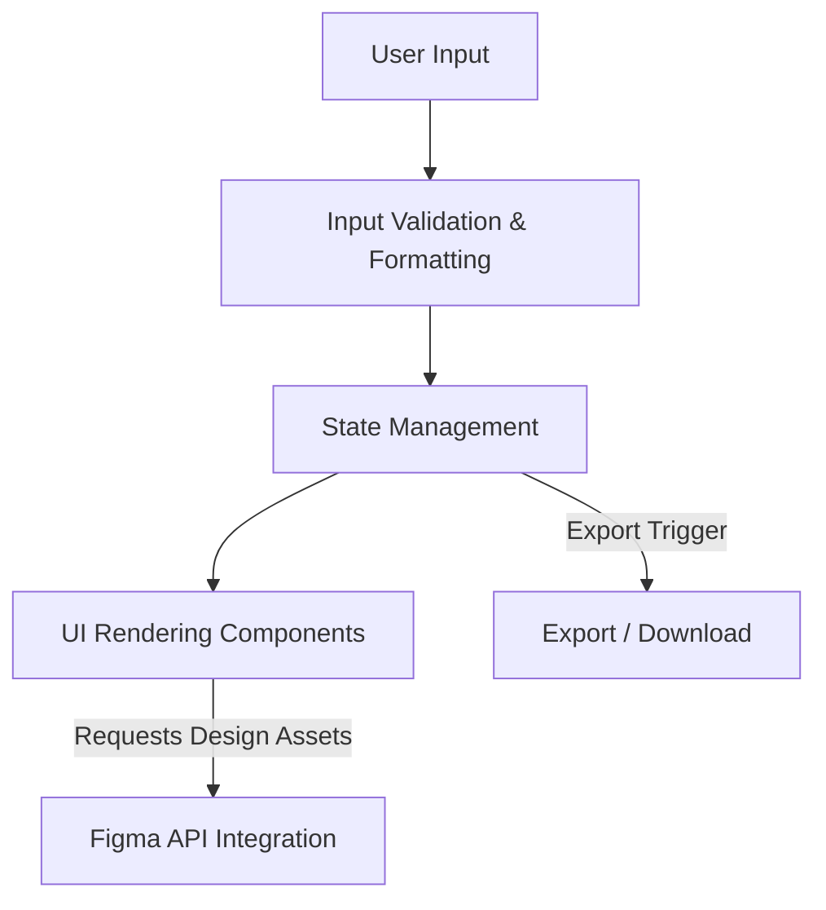

## Data Flow & Integrations

The system primarily handles data related to resume creation and visualization, orchestrating interactions between user inputs, internal processing modules, and external services such as Figma for design integration. Data enters the system mainly through user interfaces where users submit resume details or interact with UI components built with React. This input data undergoes validation and transformation within service layers and utilities before being rendered dynamically using UI components.

Throughout its lifecycle, data flows between several core modules including input handlers, state management stores, and UI rendering components. The system integrates externally with the Figma API to fetch design assets (images, layouts) and possibly to synchronize visual representations of resumes. These external requests utilize authenticated API calls, with payloads structured according to Figma’s design system schemas. Data exits the system primarily as rendered UI or serialized output formats (e.g., downloadable resume PDFs), completing the user interaction cycle.

## Module Dependencies

- **src/** → `utils`, `config`
- **components/ui/** → `utils`
- **components/figma/** → `src/components/ui`, `utils`
- **src/components/ui/** → `utils`, `src/components/ui`
- **src/components/figma/** → `src/components/figma`, `utils`
- **services/** → `utils`
- **utils/** → standalone or shared helper functions with no external dependencies

## Service Layer

- **FigmaService**: Handles authentication with Figma API, requests for design assets, manages API rate limits and caching.
- **ResumeDataService**: Processes resume data input, performs validation and formatting before passing to UI components.
- **ExportService**: Manages serialization of final resume data into downloadable formats (PDF, JSON).
- **UserInteractionService**: Captures and processes user inputs, interactions with UI components, and triggers state updates.

## High-level Flow

The core data pipeline can be summarized as follows:

1. User inputs resume data or interacts with UI components.
2. Data undergoes validation and is formatted by the ResumeDataService.
3. Validated data updates application state.
4. UI components render based on the current state.
5. Components fetch necessary design assets asynchronously from the Figma API via FigmaService.
6. Users can trigger exports, where the ExportService converts current resume data into downloadable formats.

## Internal Movement

Modules communicate primarily through shared state management patterns typical to React-based frontends, such as context providers and hooks for reactive updates. Event-driven patterns are employed, where user actions trigger service calls that update state asynchronously.

Inter-module communication with services typically uses direct method calls, while external API communication is asynchronous via HTTP requests. There are no message queue or RPC systems currently. The state is centralized and shared through React Context or similar constructs to maintain synchronization between UI and data layers.

## External Integrations

- **Figma API**
  - **Purpose:** Retrieve design assets such as images, component layouts, and styles to maintain visual consistency.
  - **Authentication:** OAuth or API key-based authentication as managed by FigmaService.
  - **Payload Shapes:** Requests typically contain project or component identifiers; responses return JSON structured design metadata and image URLs.
  - **Retry Strategy:** Exponential backoff on failure with a maximum retry count to handle rate limiting and transient network issues.

- (Future integrations could extend to LinkedIn API or job-related services)

## Observability & Failure Modes

The system implements logging primarily at service layer entry and exit points, especially around external API calls such as with Figma. This includes metrics on API response times, success/failure counts, and error tracking to diagnose and respond to failure conditions.

Failure modes involve:

- **API Call Failures:** Retries with exponential backoff; persistent failures routed to dead-letter logs.
- **Data Validation Errors:** Immediate user feedback with UI error annotations.
- **State Synchronization Issues:** Logs capture inconsistencies; UI falls back to safe states.

Monitoring can be augmented with third-party tools integrated for logs aggregation, but currently relies on in-app telemetry and console debugging.

## Related Resources

- [architecture.md](./architecture.md)
